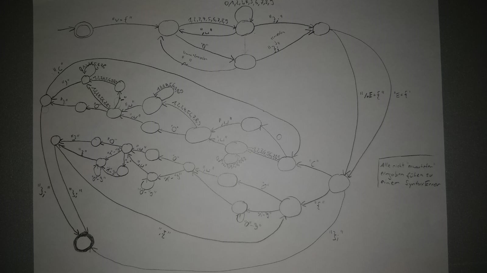

# Task 1 - Creation of a graph
## Description
Create a graph from a text file or String.
<br>The graph's representation must be "hidden" form the graph class.  
<br>Representation as AdjacencyStructure an abstract class, Subtypes are:
- AdjacencyList
- AdjacencyMatrix
<br>The content of the definition file follows following EBNF:
```
Graph = Vertecies Edges";";
Vertices = "V={"Node{", "Node}"};";
Edges = "E={"(|Edge{", "Edge})"};";
Edge = DirectedEdge|UndirectedEdge;
DirectedEdge = "("Node", "Node", "Weight")";
UndirectedEdge = "{"Node", "Node", "Weight"}";
Node = NumberNoLeadingZero;
Weight = "-"NumberNoLeadingZero;
NumberNoLeadingZero = "0"|Digits{DigitsWithZero};
DigitsWithZero = "0"|Digits;
Digits = "1"|"2"|"3"|"4"|"5"|"6"|"7"|"8"|"9";
```
## Parser

<br>Steps: 
- Formal grammar definition
- Tokenize imports
- Parse tokens -> Parse Tree
- Syntax Check ? 
## Graph

#Task 2 - Nikolaus puzzle
```
Nikolaus Graph:
     E
    / \
   /   \
  C-----D      
  |\   /|
  | \ / |
  |  X  |
  | / \ |
  |/   \|
  A-----B
```

